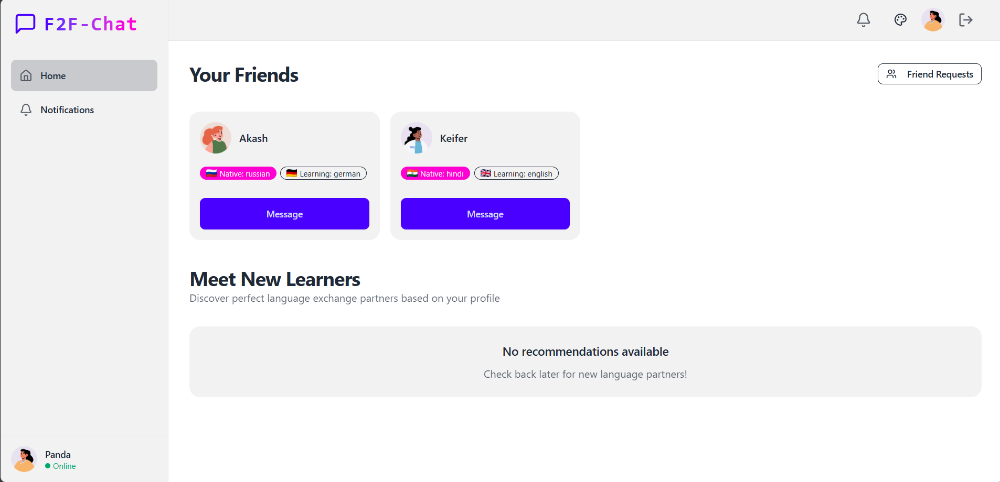
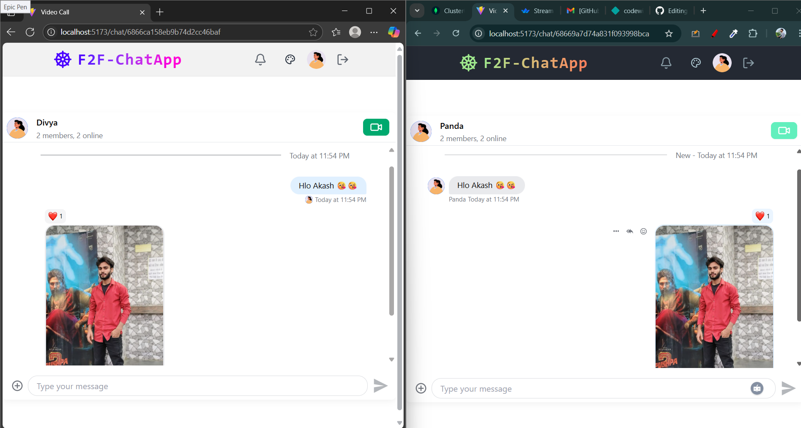
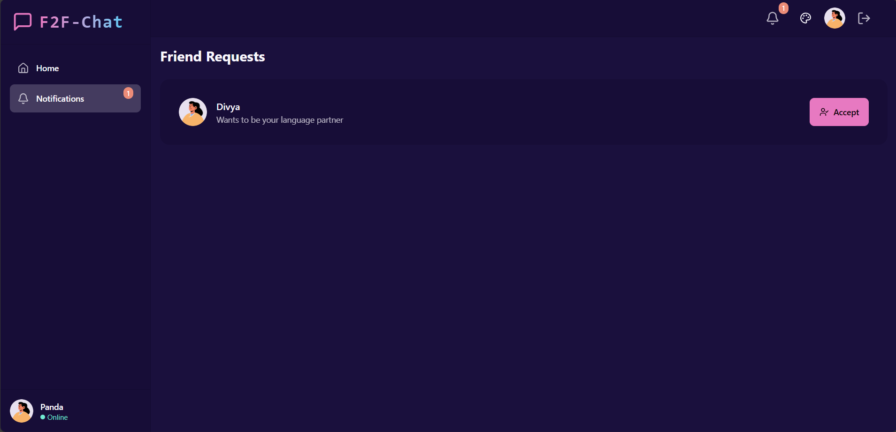
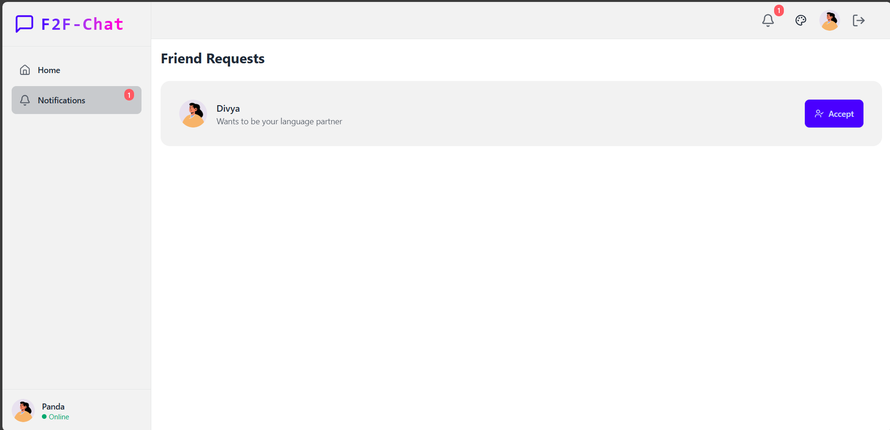

# F2F-Chat-App

## Overview

**F2F-Chat-App** is a real-time chat and video call application designed for language learners to connect, chat, and practice together. It features user authentication, friend requests, notifications, and seamless messaging with video call integration.

## Features

### 1. **User Authentication**
- Sign up and log in securely.
- Onboarding flow for new users to set up their profile, including languages and bio.

### 2. **User Profile & Onboarding**
- Users can set their profile picture, bio, native and learning languages.
- Profile information is used for recommendations and friend matching.

### 3. **Friend System**
- Send and receive friend requests.
- Accept or reject requests.
- See a list of your friends and recommended users.

### 4. **Notifications**
- Real-time notifications for incoming friend requests.
- Notification badge in Navbar and Sidebar, showing the number of pending requests.

### 5. **Chat & Messaging**
- Real-time 1:1 chat using [Stream Chat](https://getstream.io/chat/).
- Message history, typing indicators, and more.

### 6. **Video Calls**
- Start a video call from the chat page.
- Share a call link directly in the chat.

### 7. **Theme Support**
- Light and dark mode with DaisyUI/Tailwind.
- Theme is persistent and applies globally.

### 8. **Responsive Design**
- Fully responsive for mobile and desktop.
- On small devices, only the logo icon is shown in Navbar/Sidebar for a clean look.

## Tech Stack

### **Frontend**
- **Framework:** React (Vite)
- **Styling:** Tailwind CSS + DaisyUI
- **State Management:** Zustand, React Query
- **Real-time Chat:** Stream Chat React SDK

### **Backend**
- **Framework:** Node.js + Express
- **Database:** MongoDB (with Mongoose)
- **Authentication:** JWT-based

### **Other**
- **Video Calls:** (Assumed) WebRTC or similar, integrated via custom or third-party service.
- **Notifications:** Real-time updates via Stream Chat and backend events.

## Project Structure

```
Real Chat App/
  backend/
    src/
      controllers/
      models/
      routes/
      middleware/
      lib/
      server.js
  frontend/
    src/
      components/
      pages/
      hooks/
      store/
      lib/
      App.jsx
      main.jsx
```

## Screenshots

### Home Page (Dark Mode)


### Home Page (Light Mode)


### Chat Page (Chat)


### Chat Page (Video Call)


### Friend Requests (Dark Mode)


### Friend Requests (Light Mode)


## How to Run

1. **Clone the repository:**
   ```bash
   git clone https://github.com/codewithpanda28/f2f-chat-app.git
   cd f2f-chat-app
   ```

2. **Install dependencies:**
   ```bash
   cd backend
   npm install
   cd ../frontend
   npm install
   ```

3. **Set up environment variables:**
   - Create `.env` files in both `backend` and `frontend` as per the sample.

4. **Start the backend:**
   ```bash
   cd backend
   npm start
   ```

5. **Start the frontend:**
   ```bash
   cd frontend
   npm run dev
   ```

## Always Show Author Info

To ensure your name and social media links are always visible (even if someone clones the project):

1. **Add a persistent footer component in the frontend:**
   - Place it in `App.jsx` or `Layout.jsx` so it appears on every page.
   - Example:
     ```jsx
     // In Layout.jsx or App.jsx
     <footer className="w-full text-center py-2 bg-base-200 border-t border-base-300 text-xs">
       Made with ❤️ by <a href="https://akashkr-portfolio.netlify.app/" target="_blank" rel="noopener noreferrer" className="text-primary underline">Akash Kumar</a> |
       <a href="https://www.instagram.com/panda_creation_29" target="_blank" rel="noopener noreferrer" className="ml-2 text-primary underline">Instagram</a>
       <a href="https://www.linkedin.com/in/codewithpanda28/" target="_blank" rel="noopener noreferrer" className="ml-2 text-primary underline">LinkedIn</a>
     </footer>
     ```
   - This will always show, even if the project is cloned.

2. **Add your info to the README (see below).**

## About the Author

**Akash Kumar**

- [Instagram](https://www.instagram.com/panda_creation_29)
- [LinkedIn](https://www.linkedin.com/in/codewithpanda28/)
- [GitHub](https://github.com/codewithpanda28?tab=repositories)

## ⭐ Give a Star!

If you like this project, please consider [giving it a star on GitHub](https://github.com/codewithpanda28/f2f-chat-app)!  
Your support helps others discover the project and motivates further development.

## Example Footer Code (for persistent author info)

```jsx
// Add this to your Layout.jsx or App.jsx
<footer className="w-full text-center py-2 bg-base-200 border-t border-base-300 text-xs">
  Made with ❤️ by <a href="https://akashkr-portfolio.netlify.app/" target="_blank" rel="noopener noreferrer" className="text-primary underline">Akash Kumar</a> |
       <a href="https://www.instagram.com/panda_creation_29" target="_blank" rel="noopener noreferrer" className="ml-2 text-primary underline">Instagram</a>
       <a href="https://www.linkedin.com/in/codewithpanda28/" target="_blank" rel="noopener noreferrer" className="ml-2 text-primary underline">LinkedIn</a>
</footer>
```

**Replace the social links with your actual profiles!**

If you want, I can add this footer to your codebase for you. Just let me know!


